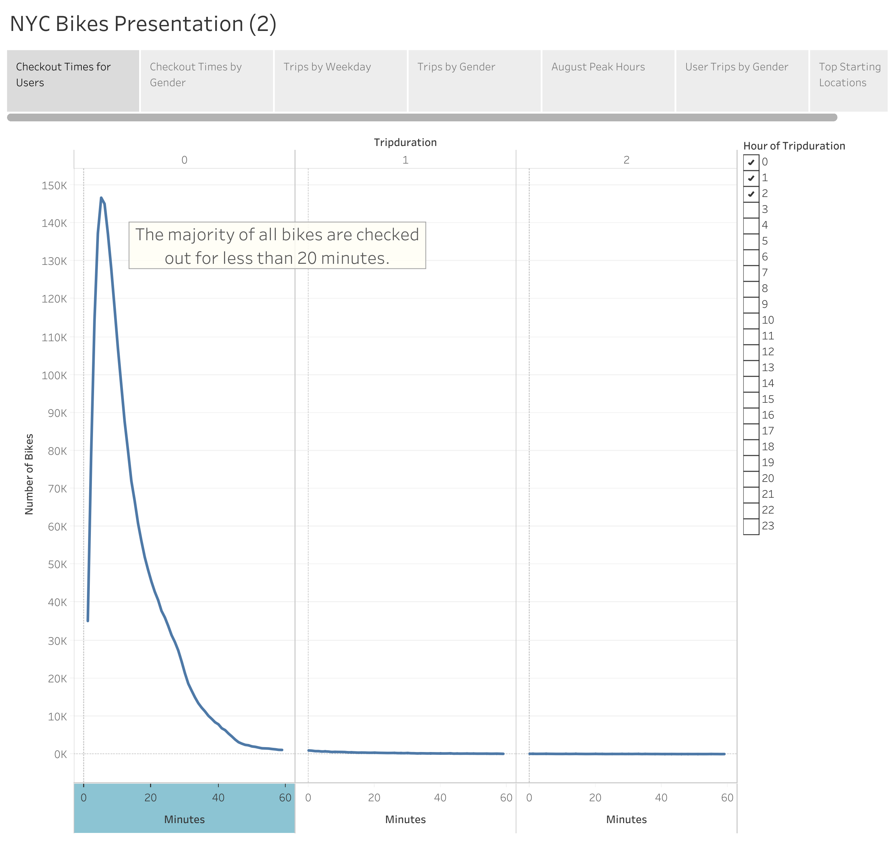
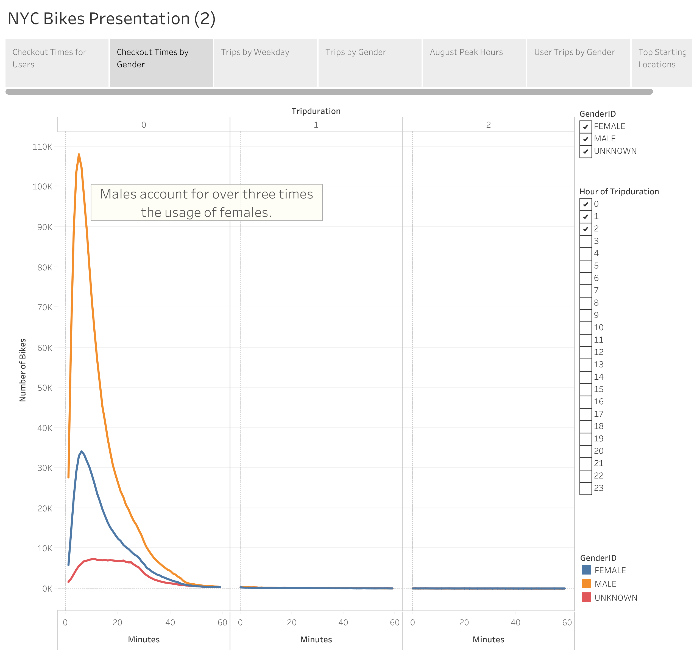
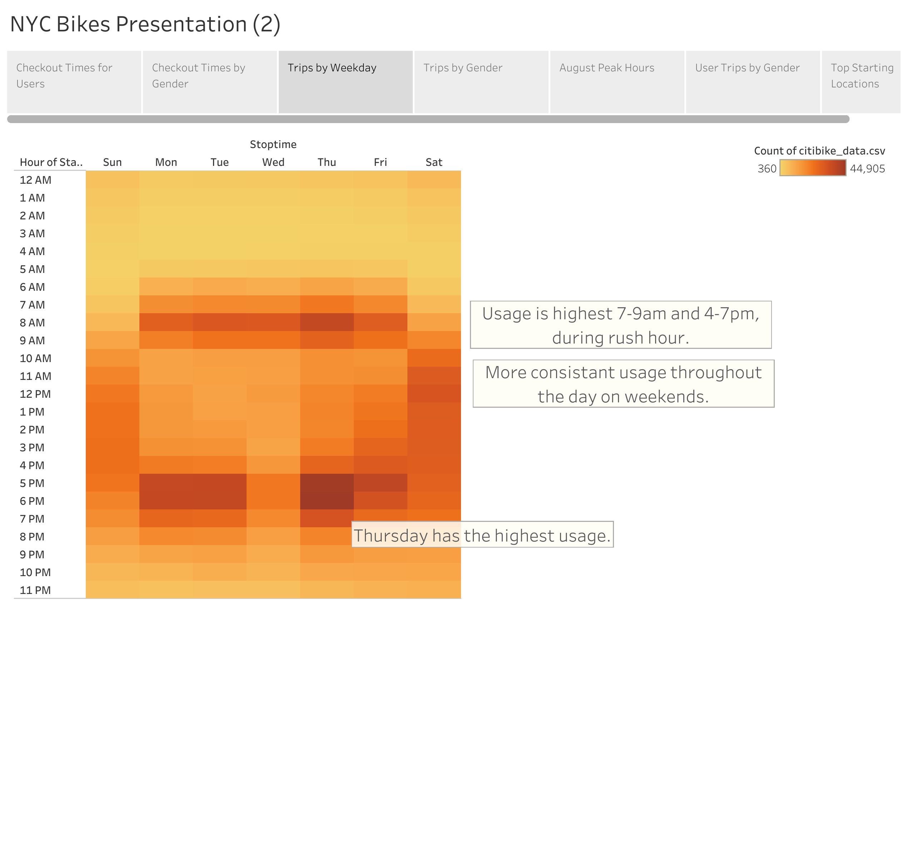
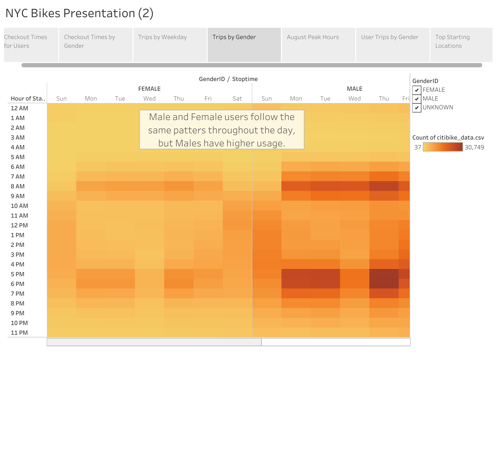
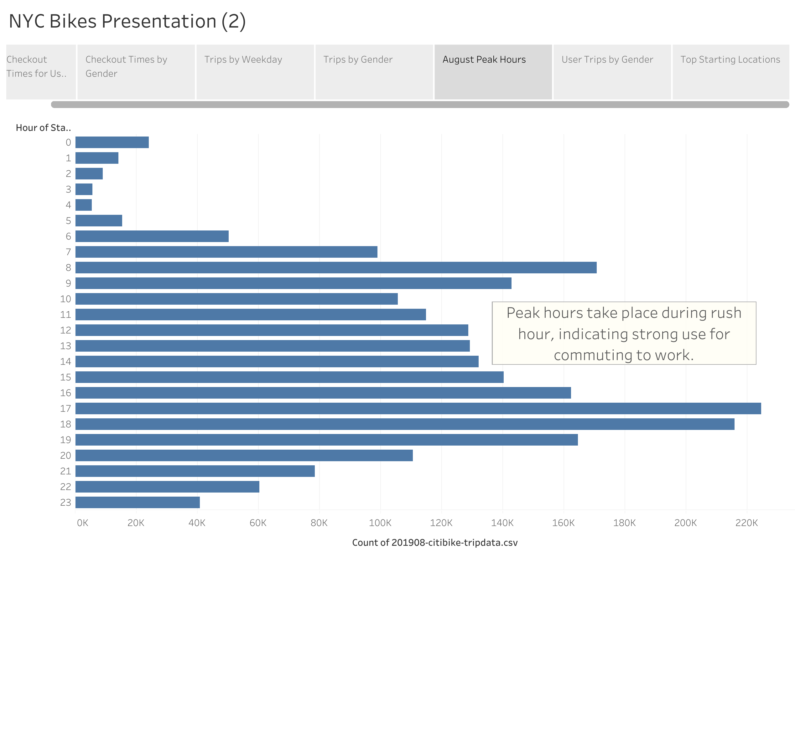
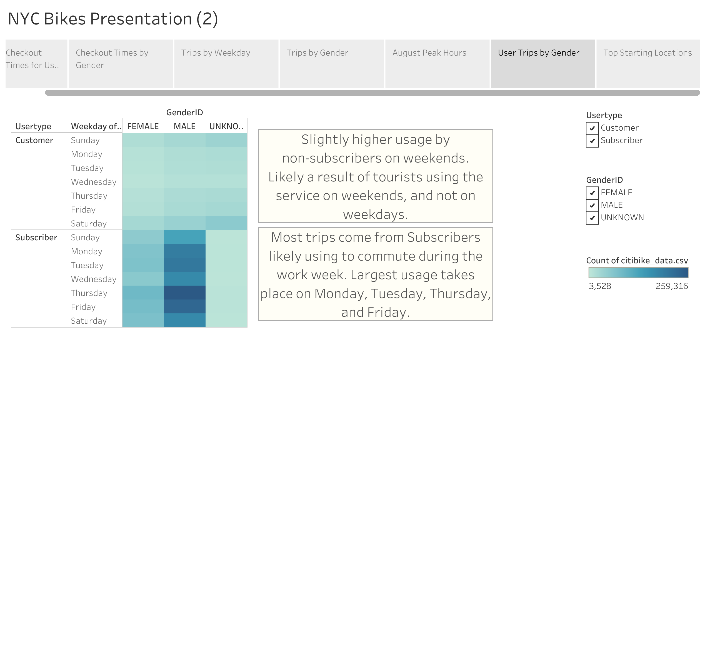
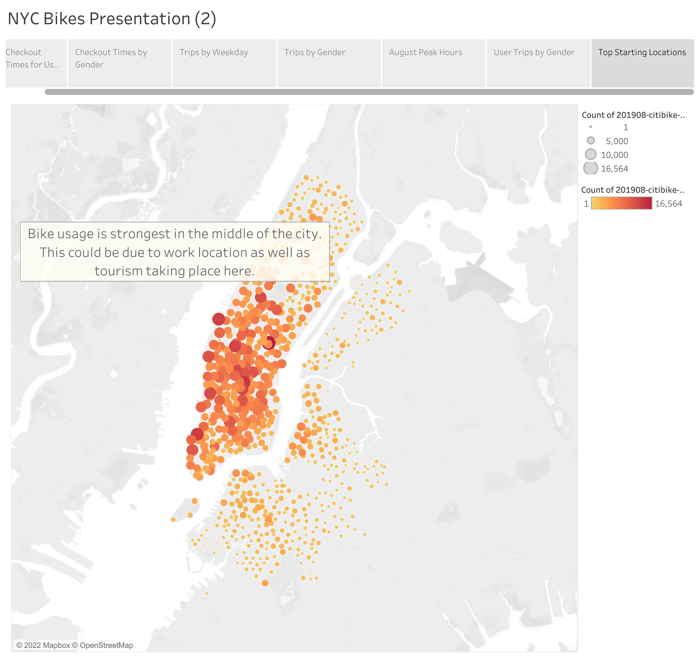

# Bike Sharing

## Overview

### Background
The client I am working with observed the success of bike-sharing services in New York City and is interested in starting a bike-sharing service in Des Moines.

### Purpose
The purpose of this project was to analyze bike-sharing data in New York City and use it to create a presentation to show the viability of a bike-sharing company in Des Moines. 

## Results

Line graph showing checkout times for all users.

Line graph showing checkout times based on gender. 

Heatmap showing bike usage throughout the week.

Heatmap showing bike usage throughout the week separated by gender.

Bar graph showing peak hours during August.

Heatmap showing usage throughout the week sorted by gender.

Map showing top starting locations for bike rentals in NYC.

### Presentation:
https://public.tableau.com/app/profile/brandon.castro2779/viz/BikeSharingData_16662367183380/NYCBikesPresentation#1

## Summary

Based on the analysis of NYC bike-sharing data I can conclude that a bike-sharing service in Des Moines would also likely be successful. Users would clearly be far lower than NYC due to a lower population density, but scaled down it should still be successful. Based on the data, most usership comes from commuters, as opposed to tourism. This is beneficial in Des Moines, as it does not get near the tourism that NYC does. With most users coming from commuters, the new company should be able to serve working professionals looking for an easy, inexpensive way to get to work. 

The NYC data can also be used to influence advertising. Analysis shows that most usership comes from males, so males should be the main advertising target when starting the company. 

To determine the effectiveness of bike-sharing, it would be crucial to analyze and create visuals for income from subscriptions and from individual customers. 

